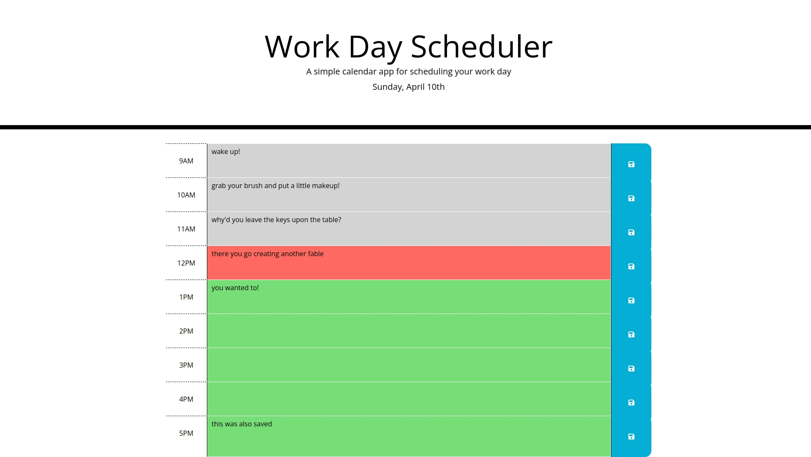

# 05 Work-Day Scheduler

## This app will help you schedule your work day

1. Simply select a time block.
2. Next, you can type a description of the event for that time blcok.
3. Click the save icon.

You will find that your data will be saved when you refresh the page.

## Links

Github:

> [https://github.com/odisclemons/05-day-planner](https://github.com/odisclemons/05-day-planner)

Page:

> [https://odisclemons.github.io/05-day-planner/](https://odisclemons.github.io/05-day-planner/)
